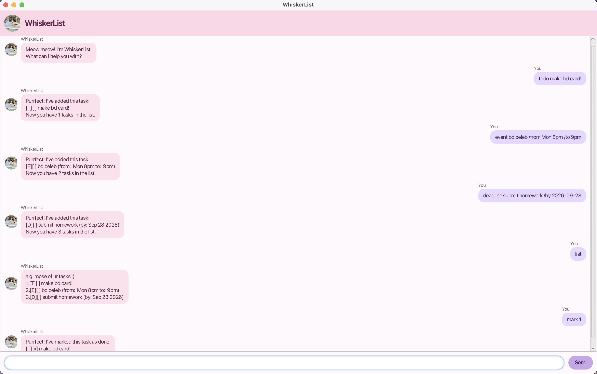

# WhiskerList User Guide

WhiskerList is a friendly task manager with a cat-themed chat interface. Use it
to keep track of to-dos, deadlines, and events. Your tasks are saved locally so
they are available the next time you start the application.



## Quick start

### Prerequisites

- Java 25
- A terminal, if you are running the project from source

### Run from source

From the project folder, run:

```text
./gradlew run
```

This opens the WhiskerList graphical interface. Type a command in the input
field and click **Send** or press **Enter**.

### Build and run the JAR

To create the executable JAR, run:

```text
./gradlew clean shadowJar
```

The JAR is created at `build/libs/whiskerlist.jar`. Run it with:

```text
java -jar build/libs/whiskerlist.jar
```

The application stores tasks in `data/anniechat.txt` relative to the folder
from which it is launched.

## Commands

Enter one command at a time. Task numbers are one-based: the first task is
task `1`.

### List tasks

```text
list
```

Shows all saved tasks and their completion status.

### Add a to-do

```text
todo read chapter 1
```

Adds a task without a date or time.

### Add a deadline

```text
deadline submit report /by 2026-10-15
```

Adds a task that must be completed by the specified date. Use the date format
`YYYY-MM-DD`.

### Add an event

```text
event project meeting /from Mon 2pm /to 4pm
```

Adds an event with a start and end time.

### Mark or unmark a task

```text
mark 1
unmark 1
```

Marks task `1` as done or changes it back to not done.

### Delete a task

```text
delete 1
```

Removes task `1` from the list.

### Find tasks

```text
find report
```

Shows tasks whose descriptions contain the search text. The search is
case-sensitive for ordinary text.

### Exit

```text
bye
```

Closes the application after displaying a goodbye message.

## Tags

Add one optional tag to a task by writing a hashtag followed by letters,
numbers, hyphens, or underscores. The tag remains part of the task
description and is shown when the task is displayed.

Examples:

```text
todo read book #school
deadline submit report #school /by 2026-10-15
event project meeting #work /from Mon 2pm /to 4pm
```

Only one tag is supported per task. Search for a tag with `find`:

```text
find #school
```

Tag searches ignore letter case, so `find #SCHOOL` also finds `#school`.

## Error handling

WhiskerList displays a friendly error message when it cannot understand a
command. Common causes include:

- leaving out the task number for `mark`, `unmark`, or `delete`;
- using a non-positive or non-integer task number;
- leaving out the keyword for `find`;
- using an invalid deadline date; and
- adding more than one tag to a task.

If the saved task file is malformed, WhiskerList reports a loading error and
starts with an empty task list. Existing data should be backed up before
editing the file manually.

## Notes

- The GUI and command-line interface use the same command-handling logic, so
  commands behave consistently in both interfaces.
- The current task format supports one tag per task.
- Keep the generated JAR and the `data` folder in locations where the
  application has permission to read and write.
